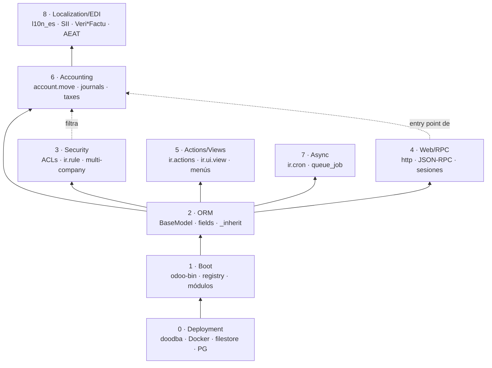

# Arquitectura interna de Odoo 19 — índice de capas

Punto de entrada de `docs/architecture/`. El agente lo carga
cuando una tarea requiere razonar sobre arquitectura interna de
Odoo, y de aquí salta a la capa relevante.

Convenciones, política de carga y proceso de creación:
[`README.md`](README.md).

## Grafo de capas

Lectura: una capa N+ depende conceptualmente de las inferiores
para tener sentido. El ETL no necesita boot, pero sí ORM y
security para no estrellarse.

## Tabla de capas

| # | Archivo | Estado | Clone? | Motivo de su prioridad |
|---|---|---|---|---|
| 0 | `0-deployment.md` | pending | no | Próximo problema de doodba/filestore/UID |
| 1 | `1-boot.md` | pending | **sí** | Próxima incidencia de "módulo no carga" |
| 2 | `2-orm.md` | pending | **sí** | Errores `_inherit`/computed fields en ETL |
| 3 | `3-security.md` | pending | **sí** | Record rules / multi-company para inpr3mium |
| 4 | `4-web-rpc.md` | pending | parcial | Próximo `_json2` 422 o sesión expirada |
| 5 | `5-actions-views.md` | pending | no | Vistas custom |
| 6 | [`6-accounting.md`](6-accounting.md) | **draft** | no | **Fase 5 ETL Holded → Odoo (activo)** |
| 7 | `7-async-cron.md` | pending | no | Crons cierre/SII |
| 8 | `8-localization-edi.md` | pending | no | Tras Fase 5 |

**Estados**:
- `placeholder` — existe vacío (con encuadre, sin contenido).
- `draft` — encuadre + diagrama + ≥3 conceptos clave + ≥1 gotcha.
- `done` — cubre la pregunta operativa al nivel que el agente
  necesita para el trabajo actual del tenant activo.

**`Clone?`** = ¿la capa probablemente requerirá clonar
`odoo/odoo` 19.0 a `../odoo-19-source/` para leer código fuente?

## Triggers de carga (para el agente)

Cuando una tarea del usuario menciona…

| Trigger | Cargar primero |
|---|---|
| `account.move`, factura, asiento, IVA, journal, payment, refund | [`6-accounting.md`](6-accounting.md) |
| record rule, `ir.rule`, "no veo registros", multi-company | `3-security.md` (cuando exista) |
| `_json2`, sesión expirada, JSON-RPC, controller, XML-RPC | `4-web-rpc.md` (cuando exista) |
| `_inherit`, computed field, constraint, onchange | `2-orm.md` (cuando exista) |
| módulo no carga, `addons_path`, registry, manifest | `1-boot.md` (cuando exista) |
| doodba, filestore, container, UID, Postgres | `0-deployment.md` (cuando exista) |
| `ir.cron`, queue_job, scheduled action | `7-async-cron.md` (cuando exista) |
| SII, Veri\*Factu, FacturaE, AEAT, `l10n_es_edi` | `8-localization-edi.md` (cuando exista) |

Si una capa aparece como `pending`, leer el área relevante de
`vendor/odoo-docs/` directamente y considerar si vale la pena
levantar la capa antes de continuar (gate explícito al
operador).

## Cómo añadir / promover una capa

1. Copia `_template.md` → `<n>-<slug>.md`.
2. Aplica los 4 pasos del proceso descrito en `README.md` y en
   `~/.claude/plans/vamos-a-crear-una-cosmic-spark.md`.
3. Actualiza la **Tabla de capas** arriba: cambia estado, convierte
   el nombre en link.
4. Anota en `docs/PLAN.md` **una sola línea de side-note** bajo
   "Histórico de cambios" — *no* abrir fase nueva.
