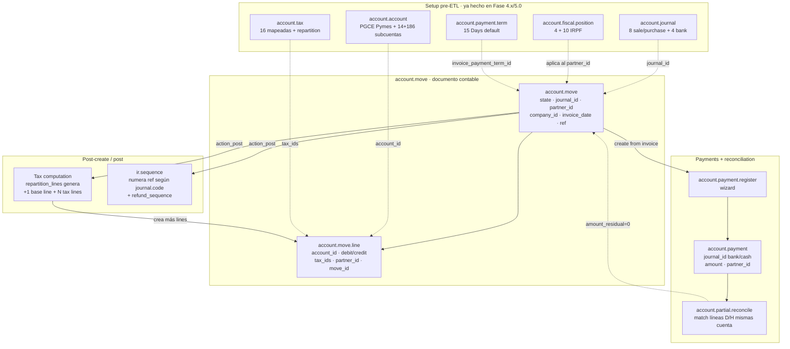

# Capa 6 — Accounting (`account.move` y vecinos)

## Pregunta operativa

Cuando el agente crea o postea un `account.move` por RPC durante
el ETL Holded → Odoo, ¿qué cómputos, validaciones y efectos
cross-model dispara la operación, y cuál es el **orden mínimo de
prerequisitos** que tienen que existir en la DB para que la
creación no se estrelle?

## Decisiones del agente que dependen de esta capa

- **Orden de carga del ETL**: subcuentas (Fase 5.0/5.1 paso 0)
  → partners → products → moves (out_invoice / in_invoice /
  out_refund / in_refund) → payments → reconciliation. El orden
  no es estilo, es dependencia dura del modelo.
- **Cómo construir `line_ids`**: pasar líneas mínimas (cuenta +
  cantidad + `tax_ids`) y dejar que el `_compute` rellene
  débito/crédito + base + cuentas IVA, **vs.** construir todo
  manualmente. Hoy: dejar al ORM, validar saldo en
  `validate_etl.py`.
- **Refunds (rectificativas)**: usar wizard
  `account.move.reversal` (probado en Fase 4.6 con
  `AC-/2026/00001`) **vs.** crear `out_refund` manual con
  `reversed_entry_id`. Wizard para mantener `prefijo` Holded
  AC-/PR- y trazabilidad.
- **Postear**: draft durante ETL hasta que `validate_etl.py`
  cuadre; `action_post` masivo al final. Posted →
  `button_draft` rompe sequence ya numerada.
- **Payments**: usar `account.payment.register` (wizard), no
  crear `account.payment` directo — el wizard hace match
  partial/full + cuadra `account.partial.reconcile`. Agrupar
  por partner antes de invocar.
- **Multi-company**: `company_id` se hereda del journal pero
  pasarlo explícito en `create` evita que el bot caiga en
  company errónea si el contexto no lo fija.

## Diagrama

## Conceptos clave

- **`account.move`** — header. Tipos relevantes (`move_type`):
  `entry` (asiento manual), `out_invoice`, `in_invoice`,
  `out_refund`, `in_refund`, `out_receipt`, `in_receipt`.
  States: `draft` → `posted` → `cancel`. Refs:
  [`vendor/odoo-docs/.../customer_invoices/overview.rst`](../../vendor/odoo-docs/content/applications/finance/accounting/customer_invoices/overview.rst),
  [`vendor/odoo-docs/.../get_started/cheat_sheet.rst`](../../vendor/odoo-docs/content/applications/finance/accounting/get_started/cheat_sheet.rst).

- **`account.move.line`** — line item. Doble función: línea de
  factura (con `tax_ids`, `quantity`, `price_unit`) **y** línea
  de asiento (con `debit`/`credit`/`account_id`). El ORM
  reconcilia ambas vistas en `_compute`.

- **`account.journal`** — sequencia (`code` = prefijo, ej. `A-`,
  `PB-`, `AC-`), `default_account_id`, `suspense_account_id`,
  `bank_account_id`. En Odoo 19 **`sequence_id` desapareció**:
  el prefijo es `code` y los abonos usan `refund_sequence` bool.
  Refs: [`.../get_started/journals.rst`](../../vendor/odoo-docs/content/applications/finance/accounting/get_started/journals.rst).
  API stub: [`.../standard_modules/account/account_account.rst`](../../vendor/odoo-docs/content/developer/reference/standard_modules/account/account_account.rst).

- **`account.account`** — chart of accounts. `account_type`
  determina semántica (asset/liability/income/expense/equity y
  subtipos). Las **subcuentas heredan `account_type` del padre
  PGCE** (cómo lo hace `derive_pgce_parent` en Fase 5.1 paso 0).

- **`account.tax` + `account.tax.repartition.line`** — un tax no
  es solo `amount`: cada lado (invoice/refund) tiene N líneas
  de repartición que rutan **base** y **tax** a cuentas
  específicas. **ISP doble-anotado**: 2 repartition_lines
  (`+input 100% / -mirror 100%`) que sustituyen el `type:group`
  + `items:[_1,_2]` de Holded — ver
  [`project_holded_tax_gotchas.md`](~/.claude/projects/-Users-carles-Documents-code-odoo-agent/memory/project_holded_tax_gotchas.md).
  Refs: [`.../taxes/tax_computation/`](../../vendor/odoo-docs/content/applications/finance/accounting/taxes/tax_computation/),
  [`.../standard_modules/account/account_tax_repartition.rst`](../../vendor/odoo-docs/content/developer/reference/standard_modules/account/account_tax_repartition.rst).

- **`account.fiscal.position`** — mapea taxes y/o cuentas según
  partner (intra-UE, extra-UE, ISP, RE). En inpr3mium las 4 +
  10 IRPF vienen de `l10n_es_pymes`, no se tocan. Aplicación
  automática vía `auto_apply` + `country_id`/`vat_required`.
  Refs: [`.../taxes/fiscal_positions/`](../../vendor/odoo-docs/content/applications/finance/accounting/taxes/fiscal_positions/).

- **`account.payment` + `account.payment.register`** — el
  wizard (transient) crea el `account.payment`, lo postea, y
  crea las `account.partial.reconcile` que enlazan líneas
  430/410 de la factura con líneas 572x del payment.
  Refs: [`.../payments.rst`](../../vendor/odoo-docs/content/applications/finance/accounting/payments.rst).

- **`account.move.reversal`** — wizard transient para
  rectificativas. Crea un `out_refund`/`in_refund` con
  `reversed_entry_id` apuntando al original. Si journal de
  destino tiene `refund_sequence=True`, usa la secuencia AC-/PR-
  separada. Probado en Fase 4.6.

- **Multi-company en queries** — `company_id` filtra
  transparentemente vía `ir.rule` (capa 3). En el ETL pasamos
  `company_id` explícito porque el bot tiene `group_multi_company`
  y el contexto puede no fijarlo.

## Gotchas conocidos

- **`ir.property` eliminado en Odoo 19**: defaults de empresa
  ahora vía `company_dependent=True` + `ir.default` (requirió
  escalación a `group_system` en Fase 5.0). Ver
  [`project_odoo19_doodba_gotchas.md`](~/.claude/projects/-Users-carles-Documents-code-odoo-agent/memory/project_odoo19_doodba_gotchas.md).
- **`res.partner.bank.journal_id` es One2many reverse** (no
  Many2one): linkear vía `account.journal.bank_account_id`
  en el journal, no en el partner.bank. Ver memoria gotchas.
- **Bot least-privilege no puede `ir.config_parameter` ni
  instalar módulos**: aceptamos escalación temporal puntual a
  `group_system` para defaults empresa. Ver tenant memory
  `decisions-log.md`.
- **Holded `p_iva_exento` es un catch-all sucio** (2.306 docs):
  mezcla ISP extra-UE no detectada + Art.20 + renting. El ETL
  reclasifica vía `tax_reclassification.yaml`, ver
  [`project_holded_tax_gotchas.md`](~/.claude/projects/-Users-carles-Documents-code-odoo-agent/memory/project_holded_tax_gotchas.md)
  + sección "Mapeo de impuestos" en
  `docs/tenants/inpr3mium/migration-from-holded.md`.
- **Bank vs tarjeta de crédito**: bancos = subcuenta `572x` +
  journal; tarjetas = subcuenta `521x` **sin** journal Odoo
  (Holded las modela como "treasury" decorativo). Ver
  [`project_holded_treasury_card_pattern.md`](~/.claude/projects/-Users-carles-Documents-code-odoo-agent/memory/project_holded_treasury_card_pattern.md)
  + tenant memory `holded-treasury-accounts.md`.
- **Numeración refund AC-/PR-**: AC- es journal **separado**
  (no `refund_sequence` en A-) porque Holded mezcla creditnote
  + rectificativas de aumento en AC-. PB- sí usa
  `refund_sequence=True` para PR-.
- **Formato sequence Odoo 19**: sale `CODE/YYYY/NNNNN`,
  purchase `CODE/YYYY/MM/NNNN`. AEAT solo exige correlatividad
  sin huecos dentro del año — se cumple. Si fedefarma necesita
  homogeneizar: `sequence_override_regex`.

## Capas vecinas

- **Depende de**:
  - Capa 2 (ORM) — `_compute`, `_inherit`, constraints sobre
    saldo D/C, `onchange` de partner que dispara fiscal_position.
  - Capa 3 (Security) — `company_id` filtrado por `ir.rule`,
    grupos `account.group_account_*`.
  - Capa 4 (Web/RPC) — todos los `create`/`action_post` viajan
    por JSON-RPC desde los loaders del ETL.
- **Usada por**:
  - Capa 8 (Localization/EDI) — `l10n_es_edi_*` engancha hooks
    a `account.move.action_post` para SII / Veri\*Factu /
    FacturaE.
  - Skill `odoo-accounting-es` — operativa diaria (cierres,
    AEAT, conciliación). Esta capa es su mental model.

## Procedencia (meta)

- Encuadre: 2026-05-12
- Fuentes: vendor/odoo-docs `applications/finance/accounting/{cheat_sheet,journals,customer_invoices/overview,taxes/tax_computation,fiscal_positions,payments}` + `developer/reference/standard_modules/account/*` · agent memory `project_odoo19_doodba_gotchas` + `project_holded_tax_gotchas` + `project_holded_treasury_card_pattern` · tenant memory `decisions-log` + `holded-treasury-accounts` · **sin** código fuente (cubierto por docs + experiencia operativa Fases 4.5b/4.6/5.0/5.1) · sin internet
- Estado: **draft**
