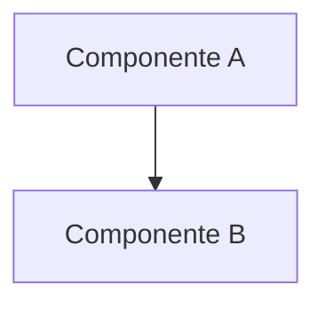

# Capa N — <nombre>

> Plantilla mecánica para nuevas capas. Copiar a `<n>-<slug>.md`
> y rellenar. Mantener ≤ 200 líneas.

## Pregunta operativa

<1-3 líneas — qué pregunta concreta debe responder esta capa al
agente cuando la cargue. Si no se puede formular nítidamente,
la capa sobra.>

## Decisiones del agente que dependen de esta capa

- <bullet 1: qué decisión cambia según lo que esta capa explique>
- <bullet 2>
- <bullet 3>

## Diagrama

## Conceptos clave

- **<concepto>**: 1-2 líneas + link canónico a
  `vendor/odoo-docs/<path>` o `../odoo-19-source/<path>` si
  aplica. **No copiar el contenido**, linkear.
- ...

## Gotchas conocidos

- <gotcha 1> — link a memory entry si existe
  (`~/.claude/projects/.../memory/<file>.md`).
- ...

## Capas vecinas

- **Depende de**: capa X — <motivo>
- **Usada por**: capa Y — <motivo>

## Procedencia (meta)

- Encuadre escrito el: <YYYY-MM-DD>
- Fuentes consultadas:
  - vendor/odoo-docs: <paths>
  - agent memory: <entries>
  - código fuente Odoo: <sí/no, paths si sí>
  - internet: <urls + fechas si aplica>
- Estado: placeholder | draft | done
